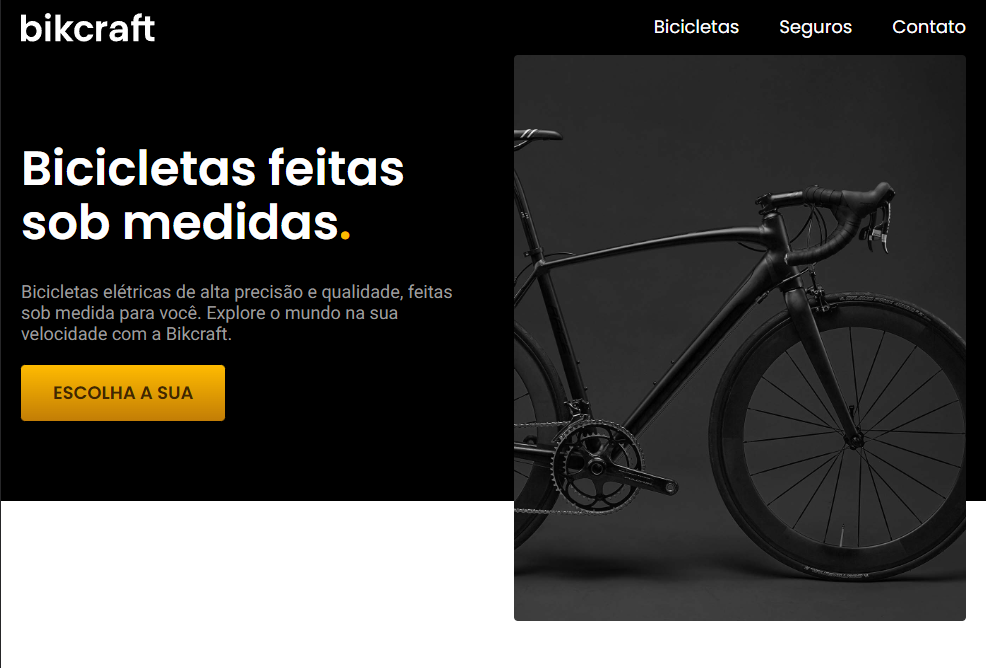

# Projeto Bikcraft 

Site realizado no módulo HTML e CSS da instituição <a style="color:#000;" href="https://www.origamid.com/" target="blank_" title="Ir para site Origamid"><strong>Origamid</strong></a>💜.

## Layout

## Demonstração
[Link demonstração](https://ismaelsilvas.github.io/bikcraft/)

## Tecnologias utilizadas
1. Javascript
2. HTML5
3. CSS3

